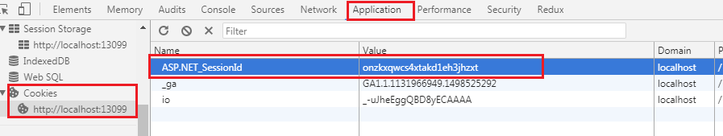

## RUN mode

1. Browse with


Set multiple browsers as default.


## ASP.NET Web Pages 


1. Create New website

Select **ASP.NET Web Site (Razor v3)**


## MVC 

1. Content Result

The following action will return content-type:text/xml

* Controller.cs

```
public ActionResult XmlDemo()
{
    string data = "<Name>JB</Name><Gender>Male</Gender>";
    return Content(data, "text/xml");
}

public ActionResult JsonDemo()
{
    var data = new
    {
        id = "JB",
        gender = "male",
        phone = "0933xxxxxx"
    };

    return Json(data, JsonRequestBehavior.AllowGet);
}
```


2. ASYNC actions in Controller 


3. ActionFilterAttribute

* Action
* Controller
* Global asax

```
protected void Application_Start()
{
    //...
    GlobalFilters.Filters.Add(new LogFilterAttribute());
}
```


4. AJAX Helper


> [Reference](http://www.c-sharpcorner.com/article/Asp-Net-mvc-ajax-helper/)


5. Add default namespaces on view

* In Views/web.config

```
<system.web.webPages.razor>
    <pages pageBaseType="System.Web.Mvc.WebViewPage">
      <namespaces>
        <add namespace="System.Web.Optimization" />
      </namespaces>
    </pages>
  </system.web.webPages.razor>
```


6. Bundle

  * Create `BundleConfig.cs`

  * Register bundles
    
    **Global.asax**

```
protected void Application_Start()
{
    BundleConfig.RegisterBundles(BundleTable.Bundles);
}
```


7. Performance tunning

* Close debug

```
<system.web>
    <compilation debug="false" targetFramework="4.6.1" />
</system.web>
```

* BundleTable.EnableOptimizations

Add `BundleTable.EnableOptimizations=true;` on `BundleConfig.cs`.

```

```


## State management

### State server

See also [https://msdn.microsoft.com/en-us/library/ms178586.aspx](https://msdn.microsoft.com/en-us/library/ms178586.aspx)

1. Enable ASP.NET State service


2. Update WebConfig

```
<system.web>
   <sessionState mode="StateServer"
      stateConnectionString="tcpip=localhost:42424" cookieless="false" timeout="20"/>
</system.web>
```

If we want to use the remote server as the state service.
Follow the following error message ,

> 無法將工作階段狀態要求送至工作階段狀態伺服器。請確定 ASP.NET 狀態服務已經啟動且用戶端與伺服器的通訊埠都相同。如果伺服器是在遠端電腦上，
> 請檢查 HKEY_LOCAL_MACHINE\SYSTEM\CurrentControlSet\Services\aspnet_state\Parameters\AllowRemoteConnection 的值，確定它是否接受遠端要求。
> 如果伺服器是在本機電腦上，而且前述登錄值不存在或設定為 0，狀態伺服器連接字串就必須使用 'localhost' 或 '127.0.0.1' 做為伺服器名稱。


### Sql server


1. Installing the Session State Database Using the `Aspnet_regsql.exe` Tool

Open *Developer Command Prompt* and use the command to enable the database.

* Use current login account

```
aspnet_regsql.exe -S SampleSqlServer -E -ssadd -sstype p
```

* Use Id/Pwd

```
aspnet_regsql.exe -S {ServerName} -U {ID} -P {Password} -ssadd -sstype p
```

| Option | Description |
|---|---|
| t  | Stores session data in the SQL Server tempdb database. This is the default. If you store session data in the tempdb database, the session data is lost if SQL Server is restarted.  |
| p  | Stores session data in the ASPState database instead of in the tempdb database.  |
| c  | Stores session data in a custom database. If you specify the c option, you must also include the name of the custom database using the -d option.  |


2. Update WebConfig

* Integrated login

```
<sessionState mode="SQLServer" sqlConnectionString="Integrated Security=SSPI;data source={server name};" />
```

or 

* ID/Pwd

```
<sessionState mode="SQLServer" sqlConnectionString="user id={id};password={pwd}" ;data source={server name};" />
```


3. The result will be stored in `tempdb`.





### Exception handling


